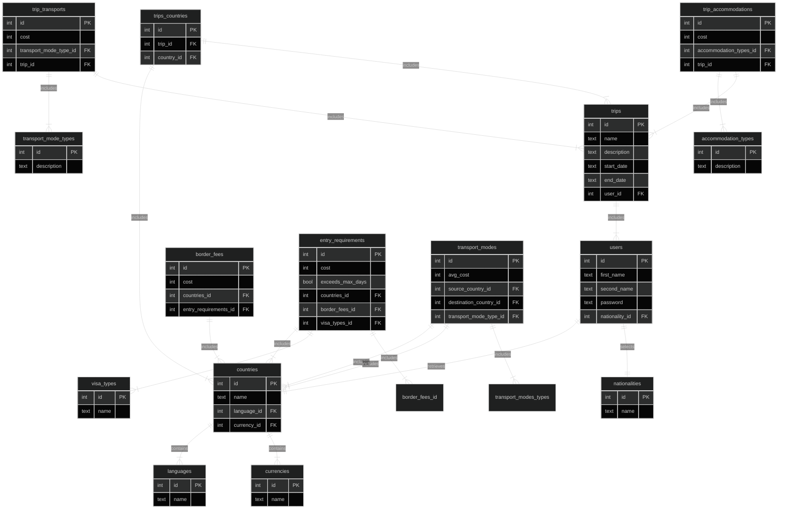

Problem Definition: 

When a user plans a trip, they face various considerations that can make the planning process complex. To address this, the travel application aims to provide a convenient web-based solution that allows users to access all the necessary information required for their trip. 

The application allows users to create an account and specify their nationality. Users can then select a country from a dropdown menu and input the duration of their stay. Based on this input, the application provides essential information such as the type of visa required, visa cost, currency used in the country, main language spoken, and available modes of travel. Some countries may have varying visa requirements depending on the user's planned duration of stay, and these variations will be accurately represented. 

Users will also have the ability to add multiple trips to their profile, allowing them to plan for future journeys. For each trip, they can specify the start and end dates, select the countries they intend to visit, and add expenses such as flights, hotels, and activities. This feature enables users to meticulously plan and budget for their upcoming adventures. 

Moscow Prioritization: 

Must-Have: 

User Account Creation: Enable users to create an account and select their nationality as EU. 

Country Selection: Provide a dropdown menu for users to select the South American country they are planning to travel to. 

Duration Selection: Allow users to input the length of their stay in the selected country. 

Information Provision: Present vital information including the type of visa required, visa cost, currency, main language spoken, and modes of travel available. 

Create a trip and add countries they are traveling to on their trip. 

Users have the option to add other bookings like hotels, flights, activities, etc., along with the cost. 

Should-Have: 

Expanded Nationality Options: Offer additional nationality options to cater to a broader range of users. 

Nationality-Based Visa Information: Provide visa information based on the user's nationality to ensure accurate and relevant details. 

Multiple Country Selection: Allow users to select multiple countries for their journey, accommodating multi-destination trips. 

Map-Based Country Selection: Implement a map interface that enables users to select their desired country visually. 

Could-Have: 

North and Central America Selection: Provide an option to select countries from North and Central America in addition to South America. 

Visa Government Website Link: Include a link to the government website for visa information, offering users more detailed resources. 

Weather Information: Integrate weather data to provide users with current and forecasted weather conditions for their selected countries. 

Activity Suggestions: Offer activity suggestions and recommendations to enhance the user's travel experience. 

Clothing Requirements: Provide information regarding appropriate clothing requirements or recommendations for each country. 

Won't-Have: 

Mobile Application Version: Development of a mobile application version of the travel app. 

Overall, the application aims to simplify the trip planning process by offering users essential information and handling varying visa requirements accurately. It allows them to select countries, retrieve relevant details, and make informed decisions about their travel plans, while also providing the option to create a trip with the start date and end date and add any other bookings required for their journey, such as flights, hotels, and planned activities. 

### Entity Relationship Diagram

 API Specification: 

User Account Management:
Create User Account: POST /users - Create a new user account with nationality and other details.
Authenticate User: POST /login - Authenticate a user with username and password.

Country Information:
Get Country List: GET /countries - Get a list of countries in South America, North America, and Central America.
Get Country Details: GET /countries/{country_id} - Get details of a specific country, including entry requirements.

Transport Information:
Get available transport modes: GET /transportmodes?source={source_country_id}&destination={destination_country_id}

Border Fees:
Get Border Fee Details: GET /borderfees/{border_fee_id}

Visa Types:
Get Visa Type List: GET /visatypes
Get Visa Type Details: GET /visatypes/{visa_type_id}

Entry Requirements:
Get Entry Requirement Details: GET /entryrequirements/{entry_requirement_id}

Trip Management:
Create Trip: POST /trips - Create a new trip with start and end dates, and associate user ID.
Get User's Trips: GET /users/{user_id}/trips - Get a list of trips associated with a specific user.
Get Trip Details: GET /trips/{trip_id} - Get details of a specific trip, including countries and bookings.
Update Trip: PUT /trips/{trip_id} - Update details of a specific trip.
Delete Trip: DELETE /trips/{trip_id} - Delete a specific trip.

Add Transport Mode to Trip: POST /trips/{trip_id}/transportmodes
Request Body: { "mode": "flight", "cost": 200 }
Update Transport Mode: PUT /trips/{trip_id}/transportmodes/{trip_transports_id}
Get Transport Mode Details: GET /trips/{trip_id}/transportmodes/{trip_transports_id}
Delete Transport Mode: DELETE /trips/{trip_id}/transportmodes/{trip_transports_id}

Add Trip_Accommodations to Trip: POST /trips/{trip_id}/accommodations
Request Body: { "mode": "hotel", "cost": 150 }
Update Transport Mode: PUT /trips/{trip_id}/accommodations/{trip_accommodations_id}
Get Transport Mode Details: GET /trips/{trip_id}/accommodations/{trip_accommodations_id}
Delete Transport Mode: DELETE /trips/{trip_id}/accommodations/{trip_accommodations_id}