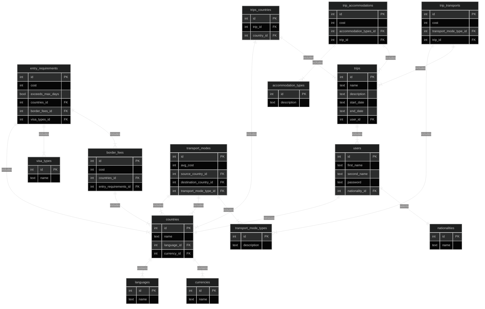

## Problem Definition
When users plan trips, they often encounter various complexities in the planning process. To tackle this, our travel application aims to provide a user-friendly web-based solution that offers access to all essential trip-related information.

The application facilitates user account creation and the selection of their nationality. Users can then choose a country from a dropdown menu and specify their intended stay duration. Based on these inputs, the application provides critical details, including required visa types, visa costs, local currency, predominant language, and available transportation options. The application is designed to accurately represent varying visa requirements that depend on the duration of the planned stay.

Users can manage multiple trips within their profile, empowering them to prepare for future journeys. For each trip, they can define start and end dates, select visited countries, and add expenses like flights, accommodations, and activities. This feature empowers users to meticulously plan and budget for upcoming adventures.

### Moscow Prioritization
**Must-Have:**

- User Account Creation: Enable account creation with the ability to choose EU nationality.
- Country Selection: Provide a dropdown menu for selecting the destination South American country.
- Duration Selection: Allow input of stay duration in the selected country.
- Information Provision: Present essential data like visa types, costs, currency, language, and travel modes.
- Create and Manage Trips: Enable users to create trips, specify countries, and add bookings with associated costs.

**Should-Have:**

- Diverse Nationality Options: Extend nationality choices to cater to a broader user range.
- Nationality-Based Visa Information: Offer visa details aligned with user nationality.
- Multi-Country Selection: Enable selection of multiple countries for multi-destination trips.
- Interactive Map Selection: Implement a map-based interface for intuitive country selection.

**Could-Have:**

- North and Central America Inclusion: Provide option to select from North and Central American countries.
- Visa Government Website Link: Include links to government visa resources for detailed information.
- Weather Integration: Incorporate weather data to offer current and forecasted conditions.
- Activity Recommendations: Suggest activities to enhance user travel experiences.
- Clothing Guidelines: Provide country-specific clothing recommendations.

**Won't-Have:**

- Mobile Application: Exclude mobile app development.

Overall, the application streamlines trip planning by furnishing essential details and accurately addressing varying visa prerequisites. It empowers users to make informed decisions about travel plans and allows them to create trips with specified dates, add bookings, and effectively budget for flights, accommodations, and activities.

### Entity Relationship Diagram




 ## API Specification: 

User Account Management:
### Users 
`GET /users`
###### Returns a list of users
Responses: 
- `200 OK`
```json
[
  {
    "user_id": 1,
    "emailAddress": "kevin.mcdermott@unosquare.com",
    "firstName": "Kevin",
    "lastName": "McDermott",
    "nationality": "Irish"
  },
  {
    "user_id": 2,
    "emailAddress": "erling.haaland@unosquare.com",
    "firstName": "Erling",
    "lastName": "Haaland",
    "nationality": "Norwegian"
  }
]
```


---

`GET /user/{userId}`
###### Returns a user account

Responses: 
- `200 OK`
- `404 Not Found`
```json
  {
    "user_id": 1,
    "emailAddress": "kevin.mcdermott@unosquare.com",
    "firstName": "Kevin",
    "lastName": "McDermott",
    "nationality": "Irish"
  },
```
`POST /users`
###### Creates an account

Request:
```json
{
   "emailAddress": "kevin.mcdermott@unosquare.com",
    "firstName": "Kevin",
    "lastName": "McDermott",
    "nationality": "Irish",
    "password": "ABC12345!"
}
```

Responses: 
- `201 Created`
- `400 Bad Request`
```json
{
    "user_id": 1,
    "emailAddress": "kevin.mcdermott@unosquare.com",
    "firstName": "Kevin",
    "lastName": "McDermott",
    "nationality": "Irish"
}
```

---

`PUT /users/{userId}`
###### Updates an account
_NOTE: Password is an optional field, if it is not supplied, it is not updated._

Request:
```json
{
    "emailAddress": "kevin.mcdermott@unosquare.com",
    "firstName": "Kevin",
    "lastName": "McDermott",
    "password": "ABC12345!"
}
```

Responses: 
- `204 No Content`
- `400 Bad Request`
- `404 Not Found`

---

`DELETE /users/{userId}`
###### Delete user account
_NOTE: This actually performs a 'soft' deletion, we don't remove the account from the database, we simply mark it as inactive._

Response: `204 No Content`

---
---

### Countries 
`GET /countries`
###### Returns a list of countries
Responses: 
- `200 OK`
```json
[
  {
    "country_id": 123,
    "name": "Brazil",
    "currency": "Brazilian real",
    "language": "Portuguese"
  },
  {
   "country_id": 898,
    "name": "Colombia",
    "currency": "Colombian Peso",
    "language": "Spannish"
  }
]
```


---

`GET /country/{countryId}`
###### Returns details for a specific country

Responses: 
- `200 OK`
- `404 Not Found`
```json
  {
    "country_id": 123,
    "name": "Brazil",
    "currency": "Brazilian real",
    "language": "Portuguese"
  },
```


### Border Fees 
`GET /countries/{country_id}/borders/{border_country_id}`
###### Returns the border fee when entering a country
Responses: 
- `200 OK`
- `404 Not Found`
```json
[
  {
    "border_fee_id": 654,
    "sourceCountry": "Brazil",
    "destinationCountry": "Colombia",
    "borderfee": "$12"
  }
]
```

### Entry Fees 
`GET /countries/{country_id}/visatypes/{visa_type_id}`
###### Returns All fees required to enter a country
Responses: 
- `200 OK`
- `404 Not Found`
```json
[
  {
    "entry_id": 1,
    "visa": "ESTA",
    "Visafee": "$15",
    "borderfee": "$12"
  }
]
```

### Transport 
`GET /transportmodes?source={source_country_id}&destination={destination_country_id}`
###### Returns the transport options from source Country to Destination country
Responses: 
- `200 OK`
- `404 Not Found`
```json
{
  "transportmode_id": 1,
  "available_options": [
  {
    "mode": "Flight",
    "average_cost": 300
  },
  {
    "mode": "Bus",
    "average_cost": 50
  },
  {
    "mode": "Car Rental",
    "average_cost": 100
  },
  {
    "mode": "Boat",
    "average_cost": 200
  }
]
}
```
### Trips
`POST /trip`
###### Creates a trip for the user 

Request:
```json
{
  "name": "South America Trip",
  "user_emailAddress": "kevin.mcdermott@unosquare.com",
  "start_date": "2023-08-01",
  "end_date": "2023-08-10",
  "countries": [
    {
      "country_id": 1,
      "country": "Colombia"
    },
    {
      "country_id": 2,
      "country": "Brazil"
    }
  ]
}
```

Responses: 
- `201 Created`
- `400 Bad Request`
```json
{
  "trip_id": 1,
  "name": "South America Trip",
  "user_emailAddress": "kevin.mcdermott@unosquare.com",
  "start_date": "2023-01-01",
  "end_date": "2023-03-10",
  "countries": [
    {
      "country_id": 1,
      "country": "Columbia"
    },
    {
      "country_id": 2,
      "country": "Brazil"
    }
  ]
}
```

---

`PUT /trip/{trip_id}`
###### Updates details of a specific trip for the user 

Request:
```json
{
  "name": "South America Trip",
  "user_emailAddress": "kevin.mcdermott@unosquare.com",
  "start_date": "2023-08-01",
  "end_date": "2023-08-10",
  "countries": [
    {
      "country_id": 1,
      "country": "Colombia",
    },
    {
      "country_id": 2,
      "country": "Brazil"
    }
  ]
}
```

Responses: 
- `204 No Content`
- `400 Bad Request`
- `404 Not Found`
```json
{
  "trip_id": 1,
  "name": "South America Trip",
  "user_emailAddress": "kevin.mcdermott@unosquare.com",
  "start_date": "2023-01-01",
  "end_date": "2023-03-10",
  "countries": [
    {
      "country_id": 1,
      "country": "Columbia"
    },
    {
      "country_id": 2,
      "country": "Brazil"
    }
  ]
}
```


---

`GET /users/{user_id}/trips`
###### Get a list of trips associated with a specific user 


Responses: 
- `200 OK`
- `404 Not Found`
```json
{
  "trip_name": "South America Trip",
  "user_emailAddress": "kevin.mcdermott@unosquare.com",
  "trips": [
    {
     "trip_id": 1,
     "trip_name": "South America Trip",
      "start_date": "2023-01-01",
      "end_date": "2023-03-10",
      "countries": [
      {
          "country_id": 1,
          "country": "Columbia"
      },
      {
          "country_id": 2,
          "country": "Brazil"
      }
    ]
  },
  {
      "trip_id": 2,
      "trip_name": "North America Trip",
      "start_date": "2023-07-01",
      "end_date": "2023-10-28",
      "countries": [
      {
          "country_id": 4,
          "country": "USA"
      },
      {
          "country_id": 5,
          "country": "Canada"
      }
    ]
   }
  ]
}
```


---

`GET /trips/{trip_id}`
###### Get details of a specific trip, including countries and bookings 


Responses: 
- `200 OK`
- `404 Not Found`
```json
{
  "trip_id": 1,
  "name": "South America Trip",
  "user_emailAddress": "kevin.mcdermott@unosquare.com",
  "start_date": "2023-01-01",
  "end_date": "2023-03-10",
  "countries": [
    {
      "country_id": 1,
      "country": "Columbia"
    },
    {
      "country_id": 2,
      "country": "Brazil"
    }
  ],
  "transports": [
    {
      "trip_transports_id": 1,
      "mode": "flight",
      "cost": 200
    },
    {
      "trip_transports_id": 2,
      "mode": "bus",
      "cost": 50
    }
  ],
  "lodgings": [
    {
     "trip_lodging_id": 76,
      "description": "hotel",
      "cost": 200
    },
    {
     "trip_lodging_id": 46,
      "description": "Airbnb",
      "cost": 200
    }
  ]
}
```

---


`DELETE /trips/{trip_id}`
###### Delete a specific trip
_NOTE: This actually performs a 'soft' deletion, we don't remove the account from the database, we simply mark it as inactive._

Response: `204 No Content`

---

`POST /trips/{trip_id}/transportmodes`
###### Creates a transport mode for the trip

Request:
```json

    {
      "mode": "flight",
      "cost": 200
    }
```

Responses: 
- `201 Created`
- `400 Bad Request`
```json
{
     "trip_transports_id": 46,
      "mode": "flight",
      "cost": 200,
      "trip_id": 1
}
```

---

`PUT /trips/{trip_id}/transportmodes/{trip_transports_id}`
###### updates transport mode for the trip

Request:
```json

    {
      "mode": "flight",
      "cost": 200,
    }
```

Responses: 
- `204 No Content`
- `400 Bad Request`
- `404 Not Found`
```json
{
      "trip_transports_id": 1,
      "mode": "flight",
      "cost": 200,
}
```

---

`GET /trips/{trip_id}/transportmodes/{trip_transports_id}`
###### updates transport mode for the trip


Responses: 
- `200 OK`
- `404 Not Found`
```json
{
      "trip_transports_id": 1,
      "mode": "flight",
      "cost": 200
}
```

---

`DELETE /trips/{trip_id}/transportmodes/{trip_transports_id}`
###### deletes a trip transport 
_NOTE: This actually performs a 'soft' deletion, we don't remove the account from the database, we simply mark it as inactive._

Response: `204 No Content`

---


`POST /trips/{trip_id}/lodgings`
###### Creates a lodging type for the trip

Request:
```json

    {
      "description": "hotel",
      "cost": 200
    }
```

Responses: 
- `201 Created`
- `400 Bad Request`
```json
{
     "trip_lodging_id": 76,
      "description": "hotel",
      "cost": 200,
      "trip_id": 1
}
```

---

`PUT /trips/{trip_id}/lodgings/{trip_lodging_id}`
###### Updates lodging type for the trip

Request:
```json

    {
      "description": "hotel",
      "cost": 200
    }
```

Responses: 
- `204 No Content`
- `400 Bad Request`
- `404 Not Found`
```json
{
     "trip_lodging_id": 76,
      "description": "hotel",
      "cost": 200,
      "trip_id": 1
}
```

---

---

`GET /trips/{trip_id}/lodgings/{trip_lodging_id}`
###### Returns lodging type for the trip

Responses: 
- `200 OK`
- `404 Not Found`
```json
{
     "trip_lodging_id": 76,
      "description": "hotel",
      "cost": 200,
      "trip_id": 1
}
```

---

`DELETE /trips/{trip_id}/transportmodes/{trip_lodging_id}`
###### Delete a trip lodging 
_NOTE: This actually performs a 'soft' deletion, we don't remove the account from the database, we simply mark it as inactive._

Response: `204 No Content`

---

